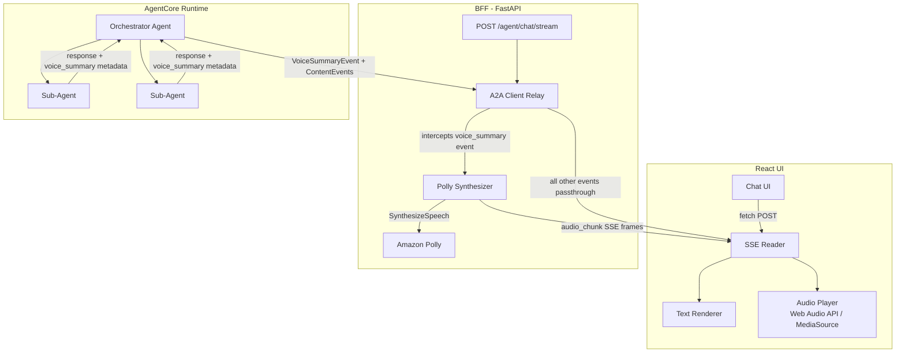
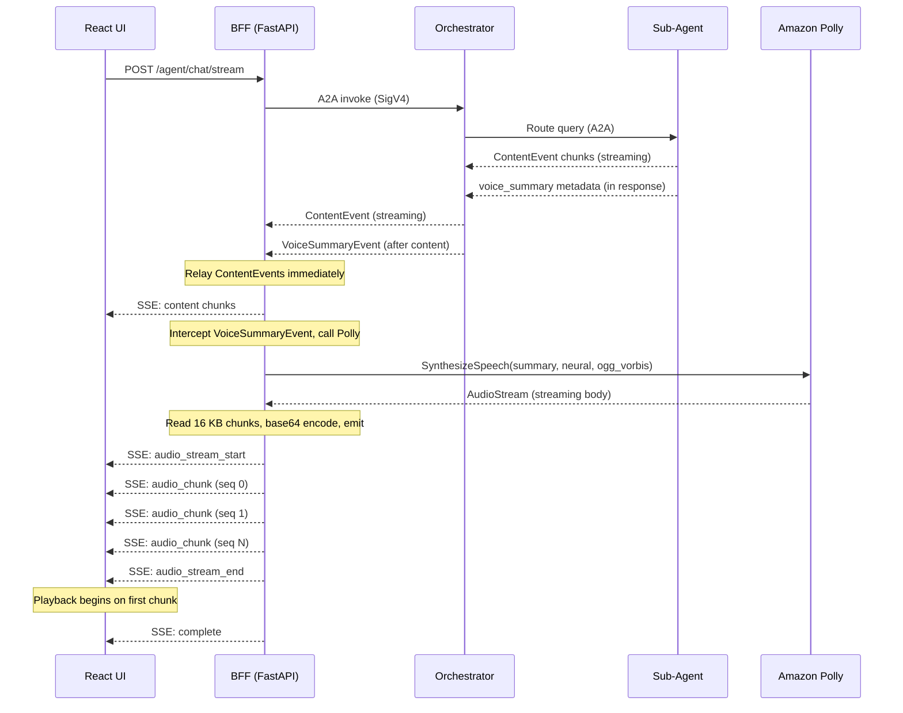

# Polly TTS Integration — High Level Design

## Overview

Add real-time text-to-speech to the existing SSE-based streaming architecture. Sub-agents produce a spoken summary of their response; the BFF synthesizes it into audio via Amazon Polly and streams base64-encoded chunks to the React UI over the same SSE connection. The browser begins playback on the first chunk — no S3, no storage, no PHI at rest.

## Design Principles

- Single transport — reuse existing SSE stream for both text and audio
- No storage — Polly `SynthesizeSpeech` is synchronous/streaming, audio flows through memory only
- No changes to AgentCore Runtime or A2A protocol — binary stays between BFF and browser
- Progressive playback — frontend plays audio as chunks arrive, not after full synthesis
- Opt-in via existing `voice_response_enabled` flag in `user_context`

## Component Diagram



## Sequence Diagram



## Key Components

| Component | Responsibility |
|-----------|---------------|
| Sub-Agent | Generates a plain-text spoken summary as hidden metadata in its response |
| Orchestrator | Extracts summary, emits `VoiceSummaryEvent`. For multi-agent turns, synthesis LLM produces a combined summary |
| BFF (Polly Synthesizer) | Intercepts `VoiceSummaryEvent`, calls Polly, reads AudioStream in 16 KB chunks, base64 encodes, emits as SSE events |
| React UI (Audio Player) | Receives `audio_chunk` events, decodes base64, feeds Web Audio API for progressive playback |
| Amazon Polly | Neural TTS — `SynthesizeSpeech` API, OGG Vorbis output, no storage |

## SSE Event Contract

| Event | Direction | Payload |
|-------|-----------|---------|
| `voice_summary` | Orchestrator → BFF | `{ summary: string }` |
| `audio_stream_start` | BFF → UI | `{ request_id, format: "ogg_vorbis", voice: "Joanna" }` |
| `audio_chunk` | BFF → UI | `{ request_id, seq: number, data: "<base64>" }` |
| `audio_stream_end` | BFF → UI | `{ request_id, total_chunks: number }` |

## Data Flow Characteristics

- 30 seconds of OGG Vorbis ≈ 300 KB raw ≈ 400 KB base64
- At 16 KB chunks ≈ 25 SSE frames
- Audio events flow after all ContentEvents complete — no interleave, no head-of-line blocking
- Browser begins decoding and playing on first `audio_chunk` arrival
- Total transfer time over typical connection: < 1 second
- No data at rest — audio passes through BFF memory only

## IAM

BFF task role gains one permission:

```json
{
  "Effect": "Allow",
  "Action": "polly:SynthesizeSpeech",
  "Resource": "*"
}
```

No S3, no KMS, no additional infrastructure.

## Decisions

| Decision | Rationale |
|----------|-----------|
| Inline streaming only (no S3) | S3 doesn't support partial reads during upload; inline gives lowest time-to-first-audio and zero PHI-at-rest |
| Polly at BFF, not orchestrator | Keeps binary out of A2A/AgentCore envelope; BFF owns the browser connection |
| 16 KB chunk size | Balances SSE frame overhead vs. progressive playback granularity |
| Sub-agent generates summary | Reuses existing clinical context and Bedrock guardrail pass |
| OGG Vorbis format | Best size/quality for speech; native browser support |
| Gated by `voice_response_enabled` | Zero impact on text-only clients |
| Audio after text, not interleaved | Text ContentEvents finish first; audio doesn't block any content delivery |

## Effort Estimate

| Work Item | Effort |
|-----------|--------|
| `VoiceSummaryEvent` schema | 2 hours |
| Sub-agent prompt updates (summary generation) | 1 day |
| Orchestrator extraction + emission | 2-3 days |
| Multi-agent combined summary (synthesizer) | 1-2 days |
| BFF Polly integration (synth + chunked SSE emit) | 2-3 days |
| IAM policy update (CDK) | 2 hours |
| React UI audio player (Web Audio API, progressive) | 3-5 days |
| Feature flag wiring | 0.5 day |
| Unit + integration tests | 3-4 days |
| Load/latency validation | 1-2 days |
| **Total** | **~3-5 weeks (2 sprints)** |
